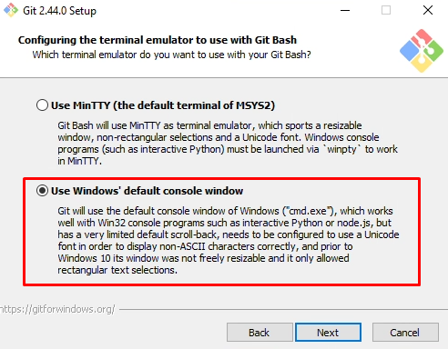
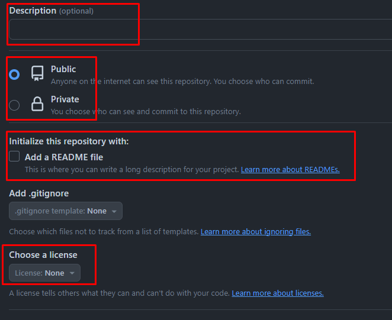

# git-cookbook

## A "how to git" guide
This is a how-to-git guide to promote reproducability, traceability and good coding ethics. Git is one of many types of 'version control', allowing repository users/owners to track what kind of changes have been made by who. In the event of failing code, version control softwares allow you to go back to a specific instance of the repository and return to that. 

This git guide will currently only cover how to use git with the Graphical User Interface (GUI). 

### General rules of thumb for git (github, gitlab, bitbucket)
* Do not create crazy long repository names
* There is no need to track edits within code, you can simply do that through the commits
* When making a commit, keep the message short and sweet
* If parts of code require attention, make an <b>issue</b> and <b>assign</b> someone to that so we know who is supposed to do what. Once an issue has been resolved, please mark issue as <b>completed</b> 

### What this guide does not <u>yet</u> cover
- Submitting git commands through command prompt/terminal

## Installation & Configuration
### What is Git?
<b>Git is =/= github or gitlab</b>

Git is a type of version control, and platforms like Github or Gitlab were designed on top of Git to support storage of code (or some data). The advantage of using Github or Gitlab is that it helps you manage large coding projects that require a lot of parallel coding between coders. It also allows for something known as Continuous Integration (CI). Imagine that you have a website and all the code you wrote that makes up the website is on github. Any change you make to that github repository is then immediately reflected on the website. 

To be able to use github (and thereby git), you are going to need a few things.
* Create an account on [<u>Github</u>](https://github.com/)
* Ensure that you are a member in this [<u>NUS-CNCS repository</u>](https://github.com/NUS-CNCS)! Contact people who are "Owners" of the repository. As of 20/04/2024, Adrian, Akash, Annabel and Leah are owners.
* Download and install [<u>Git</u>](https://git-scm.com)

### Downloading and installing Git

When installing Git, first-time users can pretty much use all default options during installation. It may involve installation of additional softwares and if you would like to minimize some of the softwares to be used, then you can also select notepad++ to be the default Git editor, as well as the use of command prompt as default terminal instead of their recommended terminal.

### Configuring git

When committing to a Github repository, they are going to want to know who you are (username) and authenticate your access so you can commit to repositories. To do that, we are going to configure our username and email so that it's a global attribute across all commits you will make to any repository. If you do have specific userIDs you want to use for other repositories, this could also be configured individually (but will not be covered in this guide). When you commit or fetch (terms that will be explained later), github may authenticate you in several ways: either prompt you for a password, or redirect you to the github browser. As of recently, you do not and should not type your password into the prompt! If the password prompt appears for some of you (within the Git GUI, not on the browser), then we will need to generate a personal access token. 

To get your Personal Access Token, go to Settings > Developer Settings > Personal Access Token

To configure your name and email, open up your command prompt (or in MacOS, Terminal)

    git config --global user.name "Any Name"
    git config --global user.email "YourGitHubEmail@email.com"

## Creating a repository

Go to [Github](https://github.com), and click the green button titled "New" on the left hand side of your Github dashboard (see below).

Choose an Owner (is it an NUS-CNCS repository or private?) and then create a repository name

Other details to note:
* **Description**: it is handy to assign a short description on what the repos is about as good practice
* **Public vs Private**: Entirely dependent on whether you are willing/are able to have the scripts on a public domain or not. 
* **README File**: Just like many repositories, the only reasony you are reading this guide right is because of the README markdown document in this repository. It is always good practice to have a README.md file as you can use it to very describe details of your repository/code in a simple and straightforward way
* **.gitignore** is only relevant if you have files generated during the execution of your code that are not important or user-specific. You can then have a .gitignore file that tells git to ignore committing/staging those files to the repository.
* **Licensing**: This is very important if you are releasing code in the public domain especially. Licensing protects you in many ways, such as freeing you from liability and warranty if your code resulted in erroneous data that had real-world implications (take for example, a hydrological model that erroneously predicted flooding in a different district or at vastly different magnitudes). In addition, licensing can also help protect your Intellectual Property Rights (IP), such as preventing commercialisation or whatnot. 

When done, click "Create Repository".

## Cloning and pushing commits

Once you have created a repository on github, you can now 'clone' a copy of it onto your local machine. To do this, simply use command prompt, navigate to the folder you want to clone your repository to, and then run the following commands. 

**Windows & MacOS**

    cd documents/testfolder
    git clone https://github.com/NUS-CNCS/git-cookbook

If you are successful, you should see a cloned folder that contains a translucent '.git' folder.

## Staging and committing changes
Look for your "Git GUI" app, open it and click on "Open Existing Repository"

Navigate to where your cloned github repository folder is, select folder, then open it

You should see the following:

Rule of thumb: all your changes are local until you **push** your commits!
1. Stage
2. Commit
3. Push

If you've successfully followed all the steps, you should see the following:

What if someone committed changes and you want to have the latest version of the repository on your local machine? Simple "Fetch":

